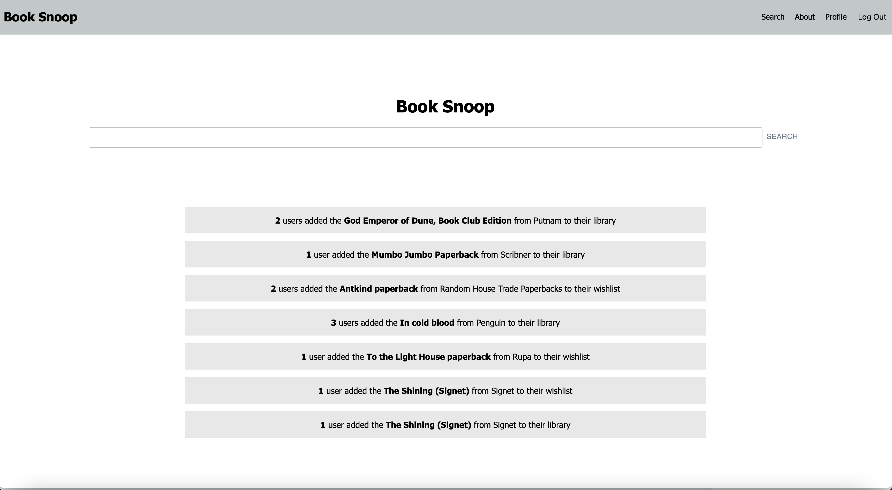
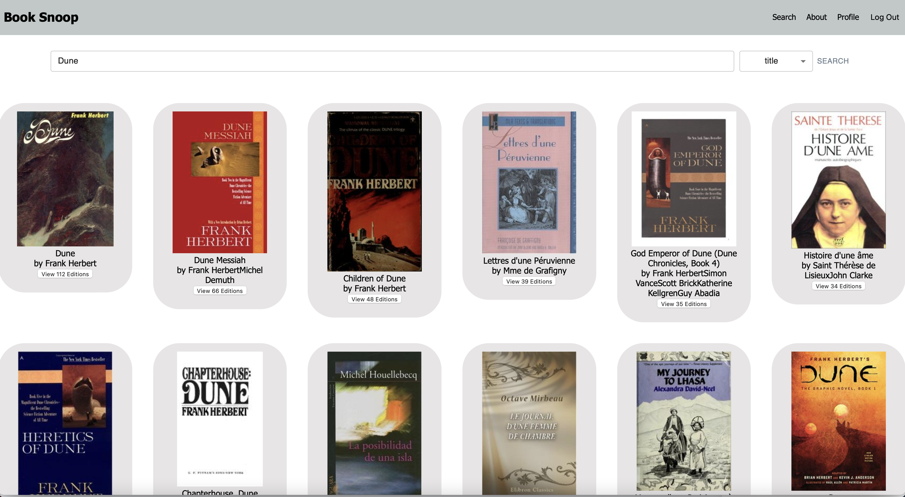
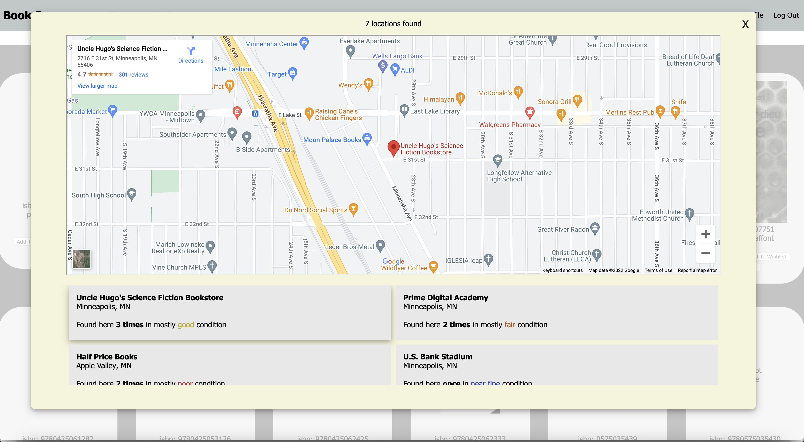
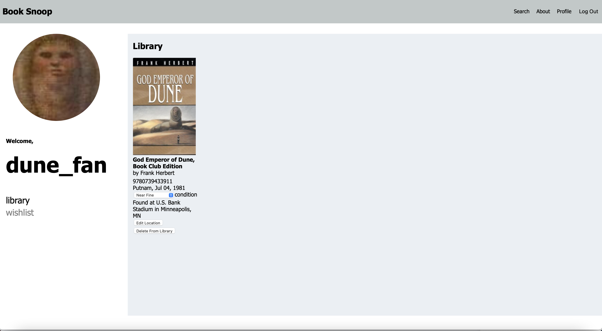
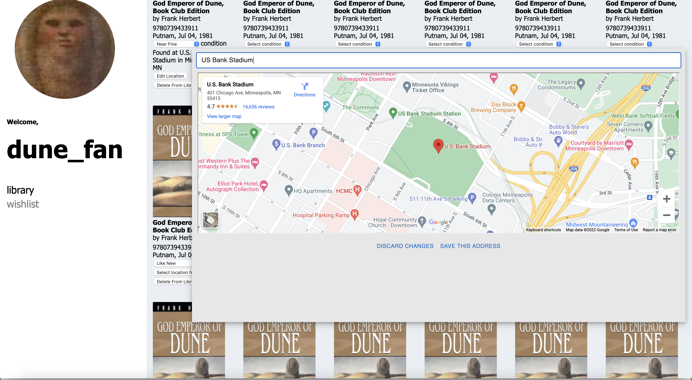

# Book Snoop

## Description
**Prime Solo Project**
*Duration: Two Weeks*

Book Snoop is a full-stack book hunting application designed to help users find a specific edition of a book. Users can browse for an edition using the app's search functionality and then add a given edition to their profile's wishlist or library. 

Upon adding an edition to their library, a user may enter the location where they found the addition along with what condition it was found in. This information is then compiled and integrated into the search tool, giving other users a list of addresses where a particular edition was found, and in what average condition. User activity is also featured in a social feed on the home page.

Apart from meeting CRUD requirements, all project functionalities were decided upon individually, and all third-party technologies used were self-taught.

The original project scope document, including first-draft wireframes, can be viewed [here](https://docs.google.com/document/d/1O1XUeNeHpviY5gMuPJp8IkpHf3p2MvFUtE-66Uqrs2Q/edit?usp=sharing)

## Final Product Snapshots
`Home`

`Search View`

`Address List View`

`Profile`

`Profile Edit View`

### Prerequisites
    • Node.js
    • Postgres
    • Google Cloud Account
    • Cloudinary Account

## Installation and Setup

Visit the fully deployed app [here](https://polar-woodland-75929.herokuapp.com/)

Or, run it locally:

1. Clone this repository from Github
2. Create a free [Google Cloud](https://cloud.google.com) account
  - From the **Google Maps Platform** page, create an API key
  - On this key, enable the **Places API** and the **Maps Embed API**
  - Save this key!

3. Create a free [Cloudinary](https://cloudinary.com) Account
  - Once you have a cloud and an attached cloud name (following the new user instructions), go to the **Settings** page and click the **Upload** tab
  - Scroll down to **Upload Presets**, and click **Add upload preset**
    - Turn the signing mode for this new preset to **Unsigned**
    - Turn 'Use filename or externally defined Public ID' to **on**
    - Turn 'Unique filename' to **on**
  - Save this new preset's name for later, and **don't turn on any access restrictions**

  - If you'd (optionally) like a default profile picture for your users, upload a picture to your cloud and name it `default_avatar.jpg_ikhsuf`

4. Create a `.env` file on the top level of your project files
  - In your `.env` file, create the following keys on lines 1-5
    - `SERVER_SESSION_SECRET=Insert any random string of characters here`
    - `API_KEY=Insert your google API key here`
    - `REACT_APP_API_KEY=Insert your google API key here`
    - `REACT_APP_CLOUDINARY_NAME=Insert your Cloudinary cloud name here`
    - `REACT_APP_CLOUDINARY_PRESET=Insert your Cloudinary preset name here`
  

5. Create a database titled "book_snoop" and create the tables found in `database.sql`
6. Run `npm install` in your terminal to download the necessary modules
7. Run `npm run client` to start React
8. In a separate terminal, run `npm run server` to start the server
9. Visit http://localhost:3000 in your browser to view the project!

## Usage

From the home page, search for a book! To refine your search, you can select 'title' or 'author' as your query type on the search page. 

From the search results page, click on a book's 'view editions' button to see all existing publication versions of that book. When you find an edition of a book that you like, log in or register to add it to your profile's library or wishlist.

From your profile page, click the default profile avatar / picture icon to upload a profile picture of your choice. From the 'wishlists' tab, click the 'move to library' button to move any book editions previously added to your wishlist to your library, or the 'delete from wishlist' button to remove it entirely. From your 'library' tab on your profile, edit an edition's 'condition' and 'location found' information. This information  is compiled and made available to other users on the 'more details' view on a book's editions page. 

## Built With

* React
* Redux-Saga
* Javascript
* Node
* Express 
* Open Library API
* Google Maps API
* Cloudinary
* SQL
* HTML
* CSS
* Material UI
* Node-Postgres
* PostgresSQL
* BcryptJS
* Passport

## Acknowledgement

Special thanks to [Prime Digital Academy!](https://github.com/PrimeAcademy) 